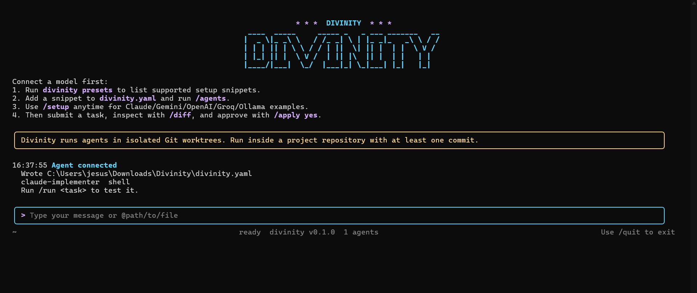

<div align="center">

  # Divinity

  **A terminal-first orchestration system for coding agents.**

  [](https://pkg.go.dev/github.com/Jotadev-bug/Divinity)
  [](https://goreportcard.com/report/github.com/Jotadev-bug/Divinity)
</div>

<div align="center">
  
</div>

<br />

Divinity runs the same task through one or more configured agents in **isolated Git worktrees**, validates the results, captures diffs and logs, and recommends the strongest candidate while keeping final approval with the user.

## ✨ Key Features

- **Isolated Sandboxing**: Agents run in isolated Git worktrees, keeping your main workspace clean.
- **Multi-Agent Orchestration**: Compare outputs from Gemini CLI, Claude Code, Aider, OpenCode, and custom scripts side-by-side.
- **Interactive TUI**: Review diffs, read logs, and apply approved patches without leaving the terminal.
- **Automated Validation**: Run tests or linting automatically against agent output before review.
- **Model Agnostic**: Supports shell agents for coding, and OpenAI-compatible APIs (Groq, Ollama, LM Studio, vLLM) for reviewing and planning.

## 🚀 Quick Start

### Prerequisites
- Go 1.22 or newer
- Git

### Installation

```sh
go install github.com/Jotadev-bug/Divinity/...@latest
divinity
```

Running `divinity` initializes the `.divinity/` directory and drops you into an interactive setup wizard to configure your first agent (Claude Code, Gemini CLI, OpenCode, Aider, Groq, Ollama, etc.).

### Using the TUI

Once inside the interactive workspace, you can:
- **Run Tasks:** Type a task and press Enter.
- **Manage Runs:** Use `/review`, `/diff`, `/logs`.
- **Apply Patches:** `/apply yes` applies the approved candidate to your workspace.

Or use CLI commands directly:
```sh
divinity compare "Add validation for empty task names"
divinity review
divinity diff
divinity apply --yes
```

## 🧠 Connecting Models

Divinity supports two practical agent styles:

1. **Shell Coding Agents** (Claude Code, Gemini CLI, OpenCode, Aider): Best for modifying files directly inside isolated worktrees.
2. **OpenAI-Compatible API Models** (Groq, Ollama, vLLM, OpenRouter): Best for planning, judging, and reviewing.

**Example Setup (`divinity.yaml`):**
```yaml
version: 1
agents:
  - name: gemini-implementer
    type: shell
    command: gemini
    args:
      - --approval-mode=yolo
      - --prompt
      - |
        Task: {{task}}
    env:
      GEMINI_SANDBOX: "false"

  - name: groq-reviewer
    type: openai-compatible
    base_url: https://api.groq.com/openai/v1
    api_key_env: GROQ_API_KEY
    model: openai/gpt-oss-20b
    system: >
      Review the implementation approach and identify risks.
```

## 🏗️ Project Architecture

```text
internal/agent         Agent CLI/API adapters
internal/cli           Cobra commands interface
internal/config        YAML configuration parsing
internal/eval          Candidate scoring logic
internal/execx         Process management
internal/orchestrator  Task & run coordination
internal/store         Filesystem persistence (.divinity)
internal/tui           Interactive terminal UI
internal/workspace     Git worktree isolation
```

## 🗺️ Roadmap

- [x] Run one task through multiple agents.
- [x] Worktree isolation and candidate validation.
- [x] TUI for diff comparison and patch approval.
- [ ] Live streaming agent logs in the TUI.
- [ ] Agentic tool-loop for standard OpenAI models.
- [ ] SQLite persistence.
- [ ] Adaptive agent selection.

## 🤝 Contributing

Contributions are welcome! Please run `go test ./...` and `divinity doctor` before submitting pull requests.

## 📄 License

This project is open-source and available under the standard MIT License.
